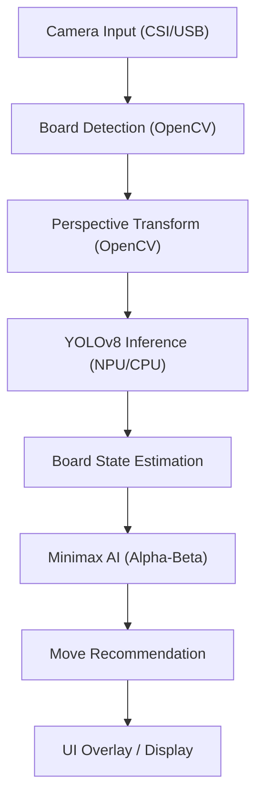
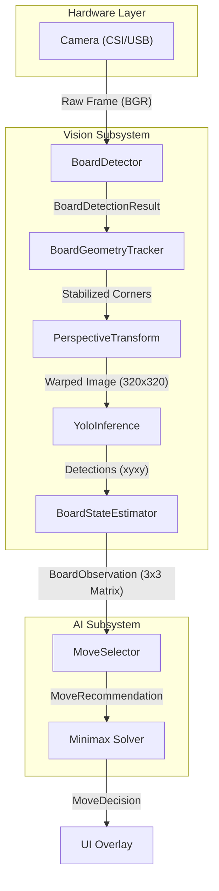
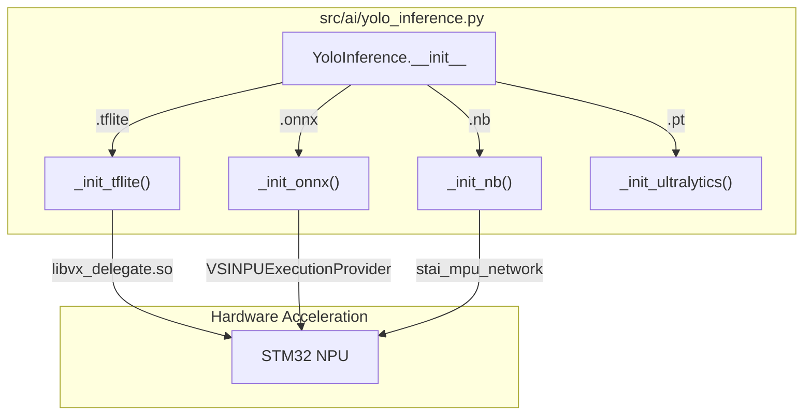
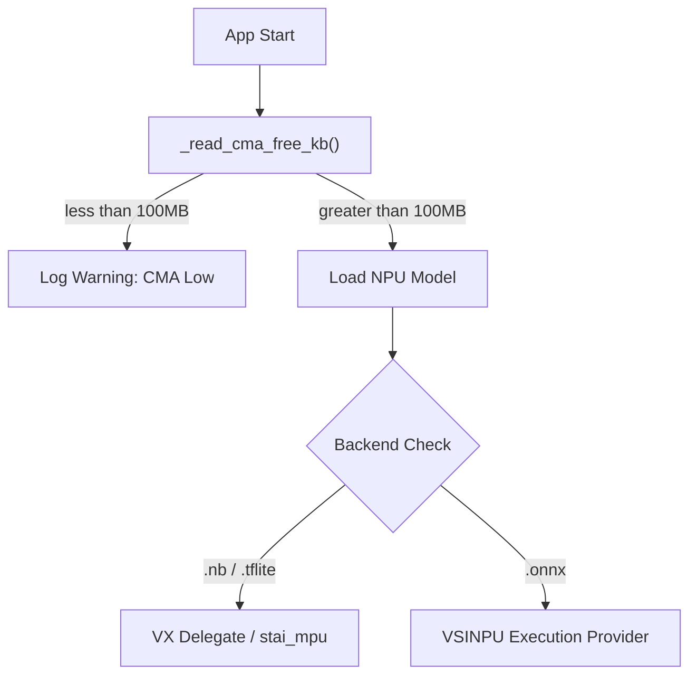

# Tic-Tac-Toe YOLO

A computer-vision-based Tic-Tac-Toe game assistant that detects a physical game board via camera, classifies cell states using a YOLOv8 model, and recommends optimal moves using a Minimax AI. Designed to run on both Windows (development) and the **STM32MP257** embedded platform with NPU acceleration.

---

## Table of Contents

- [Tic-Tac-Toe YOLO](#tic-tac-toe-yolo)
  - [Table of Contents](#table-of-contents)
  - [Overview](#overview)
  - [System Architecture](#system-architecture)
    - [High-Level Data Flow](#high-level-data-flow)
    - [Vision-to-Decision Pipeline](#vision-to-decision-pipeline)
    - [Inference Backend Selection](#inference-backend-selection)
    - [NPU Memory Safety Flow](#npu-memory-safety-flow)
  - [Project Structure](#project-structure)
  - [Prerequisites](#prerequisites)
    - [Hardware](#hardware)
    - [Software](#software)
  - [Setup \& Installation](#setup--installation)
  - [Usage](#usage)
    - [Windows (USB camera + PyTorch model)](#windows-usb-camera--pytorch-model)
    - [STM32MP257 (ONNX + NPU)](#stm32mp257-onnx--npu)
    - [STM32MP257 (Quantized Network Binary)](#stm32mp257-quantized-network-binary)
  - [Configuration Flags](#configuration-flags)
  - [Inference Backends](#inference-backends)
  - [Testing](#testing)

---

## Overview

The system operates as a vision-to-decision pipeline:

1. **Camera Acquisition** — Captures live video frames (USB webcam or CSI camera).
2. **Board Detection** — Locates the Tic-Tac-Toe board using OpenCV contour detection.
3. **Perspective Correction** — Warps the board to a canonical 320×320 top-down view.
4. **YOLOv8 Inference** — Classifies each cell as `empty`, `red_ball`, or `yellow_ball`.
5. **Board State Estimation** — Builds a 3×3 logical matrix from detections.
6. **Minimax AI** — Computes the optimal move using alpha-beta pruning.
7. **UI Overlay** — Renders the result on the video feed (OpenCV or Tkinter).

---

## System Architecture

### High-Level Data Flow



### Vision-to-Decision Pipeline



### Inference Backend Selection

The `YoloInference` class dynamically selects the execution backend based on the `--weights` file extension:



### NPU Memory Safety Flow



---

## Project Structure

```
Yolo_v8-Module/
├── src/
│   ├── main.py              # App entry point, AppConfig, FrameAnalysis, run_app()
│   ├── ai/
│   │   ├── yolo_inference.py    # Backend-agnostic YOLOv8 wrapper
│   │   ├── minimax.py           # Alpha-beta pruning Minimax solver
│   │   └── move_selector.py     # MoveDecision, recommend_move()
│   ├── vision/
│   │   ├── camera.py            # open_camera(), CameraSession
│   │   ├── board_detector.py    # BoardDetector (Canny + contours)
│   │   ├── perspective.py       # PerspectiveTransform (homography)
│   │   ├── board_state.py       # BoardStateEstimator, BoardObservation
│   │   └── stability.py         # BoardGeometryTracker (EMA smoothing)
│   ├── gui/
│   │   └── tkinter_app.py       # Multi-threaded Tkinter dashboard
│   └── tests/
│       └── test_pipeline.py     # Integration & unit tests
├── docs/
│   ├── architecture_research.md
│   └── deployment.md
├── scratch/
│   └── inspect_tflite.py        # TFLite model inspection utility
├── runs/                        # Training outputs (weights)
├── quantized_models/            # INT8 quantized .tflite models
├── data.yaml                    # YOLO dataset config
└── main.py                      # Root wrapper for src.main
```

---

## Prerequisites

### Hardware

- **Windows PC** — Development, training, and testing
- **STM32MP257 Board** — Target deployment platform with NPU
- **Camera** — USB webcam (Windows/Linux) or CSI camera (STM32MP257)

### Software

- Python 3.10+
- OpenCV
- `ultralytics` — for `.pt` / ONNX inference on Windows
- `tflite-runtime` with VX delegate — for STM32 NPU acceleration
- `stai_mpu` — for `.nb` Network Binary inference on STM32

---

## Setup & Installation

1. **Clone the repository:**

   ```bash
   git clone https://github.com/ShivamMunjal/Yolo_v8-Module.git
   cd Yolo_v8-Module
   ```

2. **Install dependencies:**

   ```bash
   pip install -r requirements.txt
   ```

3. **Prepare model weights:**
   Place your model file in `runs/detect/train/weights/` (`.pt`) or `quantized_models/` (`.tflite` / `.nb`).

---

## Usage

The main entry point is `src/main.py`, invoked via the root `main.py` wrapper.

### Windows (USB camera + PyTorch model)

```bash
python main.py --camera 2 --weights runs/detect/train/weights/best.pt --gui opencv
```

### STM32MP257 (ONNX + NPU)

```bash
python3 -m src.main --weights build/best.onnx --camera /dev/video7 --npu --gui opencv
```

### STM32MP257 (Quantized Network Binary)

```bash
python3 -m src.main --weights tictactoe_yolov8_quant_pc_uf_od_tictactoe_1.nb --camera auto --npu
```

---

## Configuration Flags

| Flag | Description | Default |
|:-----|:------------|:--------|
| `--camera` | Camera source: index, `/dev/videoX`, or `auto` | `auto` |
| `--weights` | Path to `.pt`, `.onnx`, `.tflite`, or `.nb` file | `runs/detect/train/weights/best.pt` |
| `--npu` | Enable NPU acceleration (VX delegate / stai_mpu) | `False` |
| `--gui` | UI mode: `opencv`, `tkinter`, or `demo` | `opencv` |
| `--confidence-threshold` | Minimum YOLO confidence for piece detection | `0.70` |

---

## Inference Backends

| Format | Backend | Target |
|:-------|:--------|:-------|
| `.pt` | Ultralytics (PyTorch) | Windows / Linux CPU |
| `.onnx` | ONNX Runtime + VSINPUExecutionProvider | STM32MP257 NPU |
| `.tflite` | TFLite Runtime + libvx_delegate | STM32MP257 NPU |
| `.nb` | stai_mpu_network | STM32MP257 NPU (optimal) |

---

## Testing

Run the test suite using pytest:

```bash
pytest src/tests/
```

Tests use `FakeDetector` and `FixedBoardDetector` stubs to verify the full pipeline logic without requiring physical hardware.

To inspect a TFLite model's tensor details and quantization parameters:

```bash
python scratch/inspect_tflite.py
```
