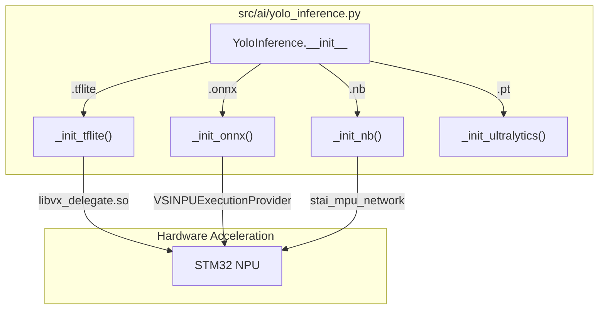
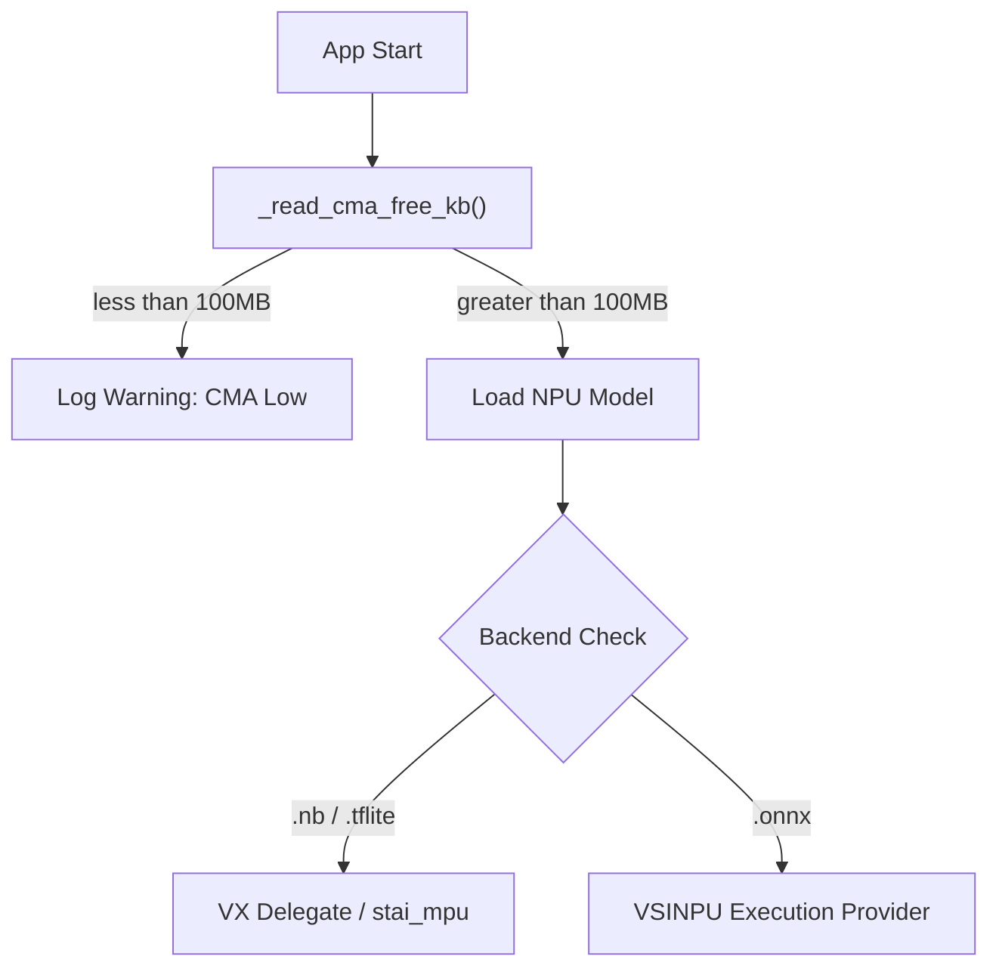
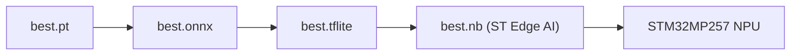

# Tic-Tac-Toe YOLOv8 Model

A YOLOv8n object detection model trained to classify the state of each cell on a physical Tic-Tac-Toe board.

---

## Table of Contents

- [Tic-Tac-Toe YOLOv8 Model](#tic-tac-toe-yolov8-model)
  - [Table of Contents](#table-of-contents)
  - [Model Overview](#model-overview)
  - [Classes](#classes)
  - [Architecture](#architecture)
    - [Inference Backend Selection](#inference-backend-selection)
    - [Preprocessing Pipeline](#preprocessing-pipeline)
    - [NPU Memory Safety Flow](#npu-memory-safety-flow)
  - [Training](#training)
  - [Quantization](#quantization)
  - [Export Pipeline](#export-pipeline)
  - [Inference Backends](#inference-backends)
  - [Project Structure](#project-structure)
  - [Configuration Flags](#configuration-flags)

---

## Model Overview

| Property | Value |
|:---------|:------|
| Base model | YOLOv8n (nano) |
| Task | Object detection |
| Input size | 320 × 320 |
| Classes | 3 (`empty`, `red_ball`, `yellow_ball`) |
| Training epochs | 100 |
| Batch size | 4 |
| Confidence threshold | 0.70 |
| NMS IoU threshold | 0.45 |
| Quantization | INT8 per-tensor |
| Target hardware | STM32MP257 NPU |

---

## Classes

| ID | Label | Description |
|:---|:------|:------------|
| 0 | `empty` | Board cell with no piece |
| 1 | `red_ball` | Board cell occupied by a red piece |
| 2 | `yellow_ball` | Board cell occupied by a yellow piece |

Defined in `data.yaml`:

```yaml
names:
  0: empty
  1: red_ball
  2: yellow_ball
```

---

## Architecture

The model is **YOLOv8n** — the nano variant of Ultralytics YOLOv8. It takes a 320×320 RGB image as input and outputs bounding boxes with class scores for each detected piece on the board.

The `YoloInference` class in `src/ai/yolo_inference.py` is a backend-agnostic wrapper. It selects the execution backend at runtime based on the model file extension.

### Inference Backend Selection



### Preprocessing Pipeline

All non-Ultralytics backends share the same preprocessing path:

1. Resize frame to model input size (`net_w × net_h`) using bilinear interpolation
2. Convert BGR → RGB
3. Normalize pixel values to `[0.0, 1.0]` by dividing by 255 (float32 models) or cast to the quantized dtype (INT8 models)
4. Transpose to NCHW if the model expects channel-first layout
5. Add batch dimension → shape `[1, C, H, W]` or `[1, H, W, C]`

Post-processing decodes the raw output tensor, applies a confidence threshold, then runs NMS with IoU threshold 0.45.

### NPU Memory Safety Flow



---

## Training

Training uses the Ultralytics YOLOv8 framework on a custom dataset of physical Tic-Tac-Toe board images.

```bash
python scripts/train.py
```

`scripts/train.py` runs:

```python
model = YOLO("yolov8n.pt")
model.train(
    data="data.yaml",
    epochs=100,
    imgsz=320,
    batch=4,
    workers=0,
    format="onnx",
    opset=12,
)
```

Trained weights are saved to `runs/detect/train/weights/best.pt`.

---

## Quantization

The model is quantized to **INT8 per-tensor** using the ST Edge AI toolchain for deployment on the STM32MP257 NPU.

Configuration (`scripts/config_quant.yaml`):

| Parameter | Value |
|:----------|:------|
| Quantization type | `per_tensor` |
| Input type | `int8` |
| Output type | `int8` |
| Input shape | `[320, 320, 3]` |
| Rescaling scale | 255 |
| Rescaling offset | 0 |

```bash
python scripts/tflite_quant.py
```

Quantized models are saved to `quantized_models/`.

---

## Export Pipeline



**Step 1 — Export to ONNX (opset 12):**

```bash
python src/stm32/export_to_onnx.py \
    --weights runs/detect/train/weights/best.pt \
    --output build/best.onnx
```

**Step 2 — Export to TFLite:**

```bash
python src/stm32/export_to_tflite.py \
    --source build/best.onnx \
    --output build/best.tflite
```

**Step 3 — Validate on STM32MP257:**

```bash
python3 /usr/local/x-linux-ai/bin/ort-vsinpu-ep-example/ort-vsinpu-ep-example.py build/best.onnx
python3 /usr/local/x-linux-ai/bin/tflite-vx-delegate-example/tflite-vx-delegate-example.py build/best.tflite
```

The `.nb` Network Binary format (produced by ST Edge AI packaging) is the optimal final format for the STM32MP257 NPU.

---

## Inference Backends

| Format | Backend | Target | Notes |
|:-------|:--------|:-------|:------|
| `.pt` | Ultralytics (PyTorch) | Windows / Linux CPU | Development |
| `.onnx` | ONNX Runtime + `VSINPUExecutionProvider` | STM32MP257 NPU | Handoff format |
| `.tflite` | TFLite Runtime + `libvx_delegate.so` | STM32MP257 NPU | Quantized INT8 |
| `.nb` | `stai_mpu_network` | STM32MP257 NPU | Optimal NPU path |

---

## Project Structure

```
.
├── src/
│   └── ai/
│       └── yolo_inference.py    # Backend-agnostic YOLOv8 wrapper
├── scripts/
│   ├── train.py                 # YOLOv8n training script
│   ├── tflite_quant.py          # INT8 quantization
│   ├── config_quant.yaml        # Quantization config
│   ├── export_saved.py          # SavedModel export helper
│   └── augment_dataset.py       # Dataset augmentation
├── scratch/
│   └── inspect_tflite.py        # TFLite tensor inspection utility
├── runs/                        # Training outputs (weights)
├── quantized_models/            # INT8 quantized .tflite models
└── data.yaml                    # YOLO dataset config (3 classes)
```

---

## Configuration Flags

| Flag | Description | Default |
|:-----|:------------|:--------|
| `--weights` | Path to `.pt`, `.onnx`, `.tflite`, or `.nb` file | `runs/detect/train/weights/best.pt` |
| `--npu` | Enable NPU acceleration (VX delegate / stai_mpu) | `False` |
| `--confidence-threshold` | Minimum YOLO confidence for detection | `0.70` |
| `--image-size` | Input image size for inference | `640` |
