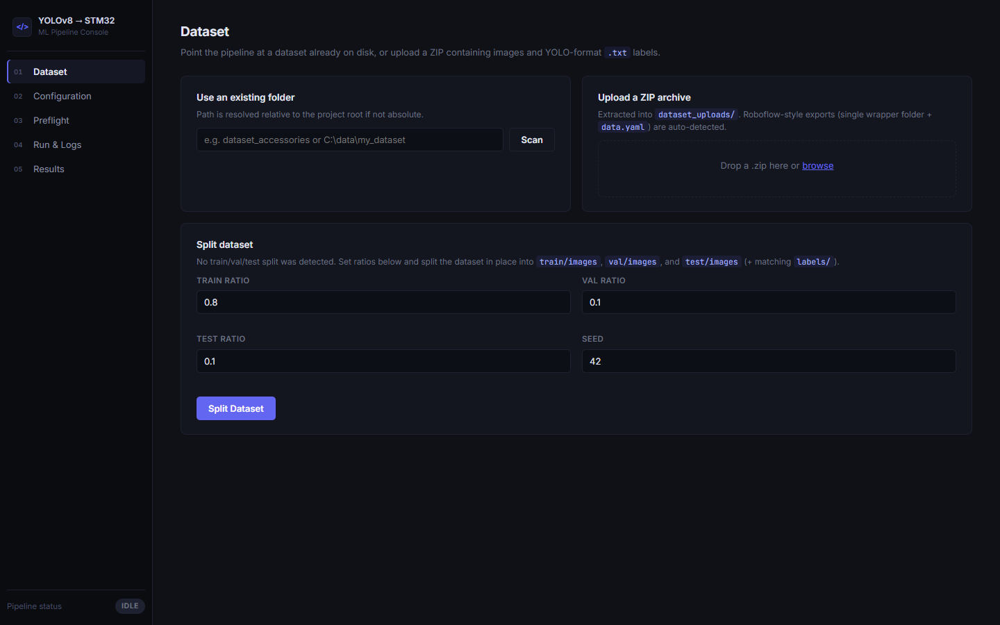
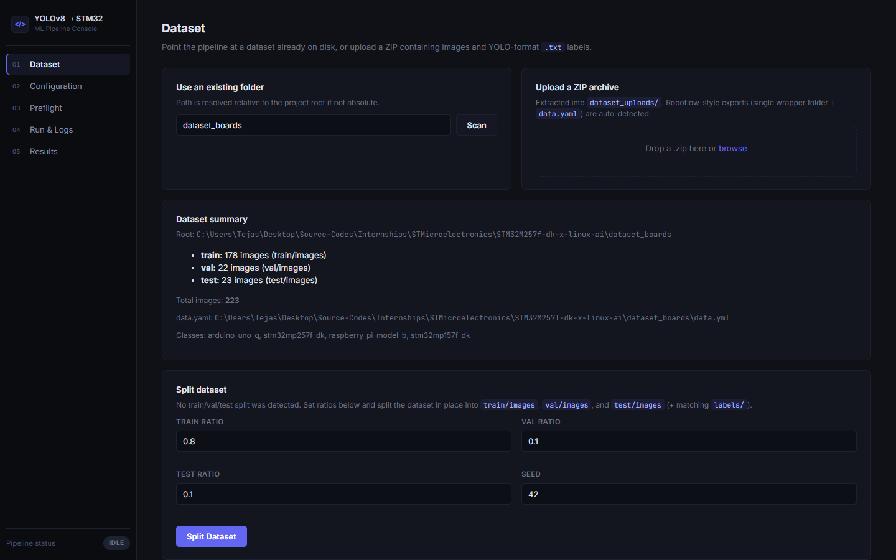
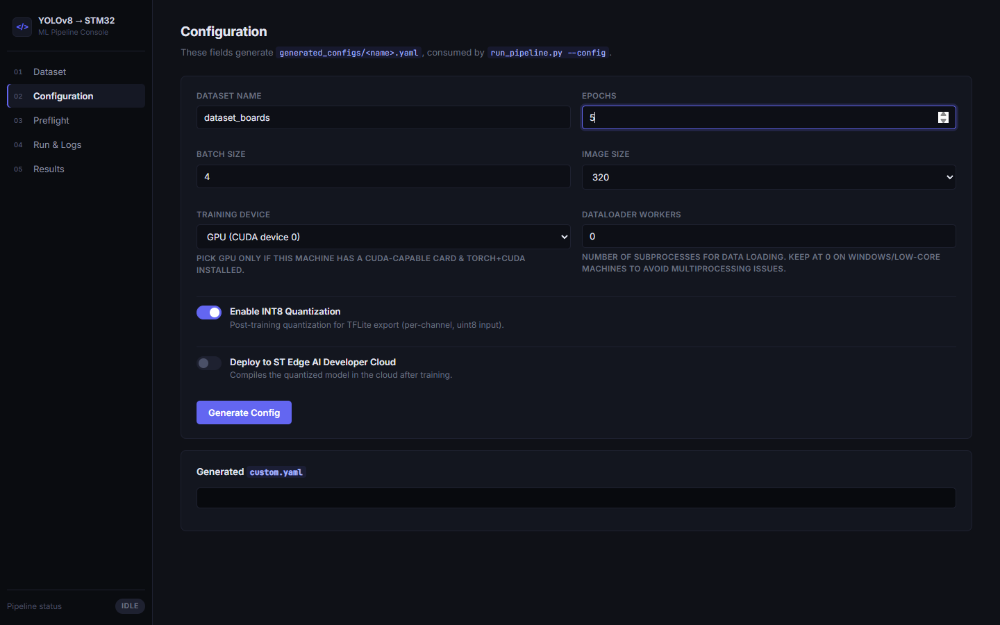
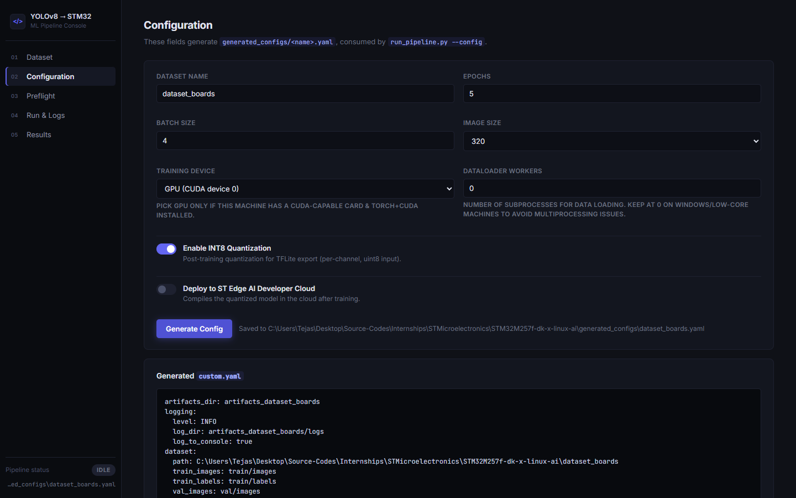
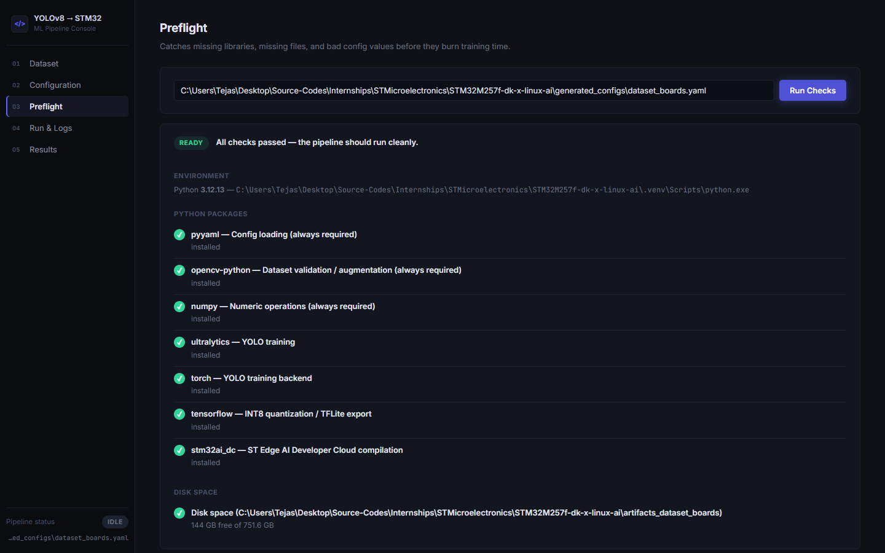
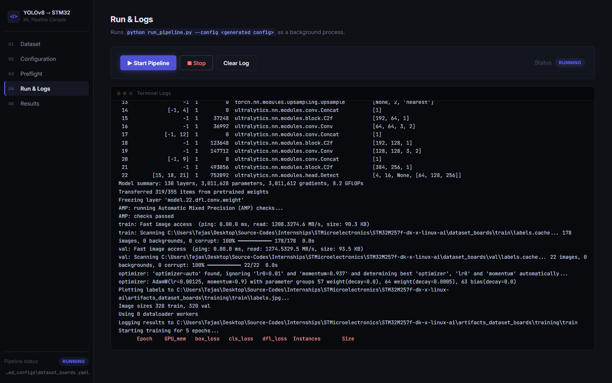
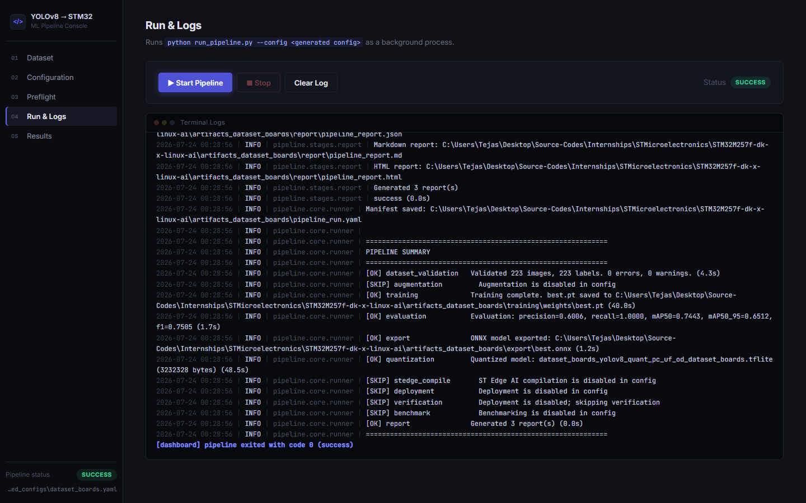
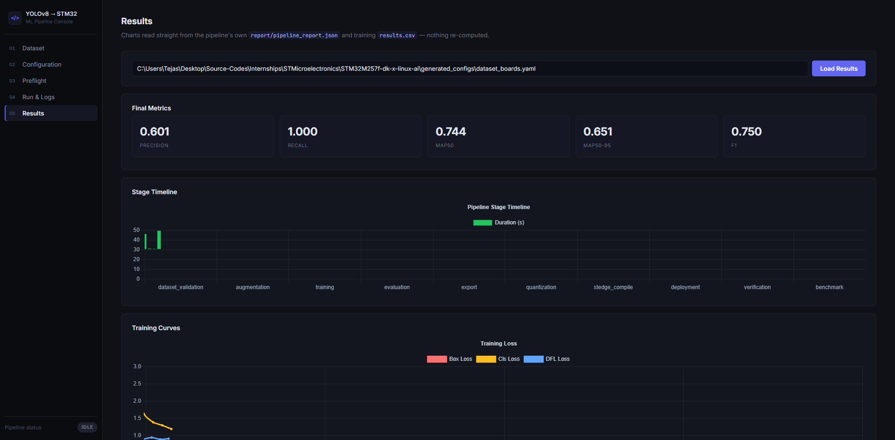

# STM32 YOLO Pipeline

Train a YOLO object detection model and deploy it to an STM32MP257F-DK board through an automated pipeline. The pipeline walks your dataset from validation all the way to a quantized model file, with optional cloud compilation through ST Edge AI Developer Cloud.



## What this does

You give it a YOLO-formatted dataset (images plus label files) and it:

1. Validates your dataset (images, labels, class distribution)
2. Augments images (brightness, contrast, blur, noise)
3. Trains a YOLOv8n model
4. Evaluates precision, recall, mAP
5. Exports to ONNX
6. Quantizes to INT8 TFLite
7. Compiles to NBG via ST Edge AI cloud (optional)
8. Deploys to your STM32 board via SSH (optional)

Each step saves its output to its own folder. If the pipeline crashes partway through, it picks up where it left off on the next run.

## Prerequisites

### Windows

- **Python 3.12.** The pipeline does not work with 3.13 or 3.14. TensorFlow and the quantization stage need 3.12 specifically.
- **uv** (package manager). Install from https://docs.astral.sh/uv/getting-started/installation/
- **Git.** Install from https://git-scm.com/download/win
- A CUDA-capable GPU is optional but makes training 10 to 50x faster. The pipeline falls back to CPU on its own.

### Linux (Ubuntu/Debian)

```bash
sudo apt update && sudo apt install -y python3.12 python3.12-venv python3-pip git
```

For GPU support, install the CUDA toolkit from https://developer.nvidia.com/cuda-downloads

### Clone the repo (with the submodule)

This repo includes `stm32ai-modelzoo-services` as a git submodule. It holds the ST Edge AI SDK (`stm32ai_dc`) that the cloud-compile stage wraps. Clone with `--recurse-submodules` so it comes down populated:

```bash
git clone --recurse-submodules https://github.com/TejasLamba2006/STM32M257f-dk-x-linux-ai.git
cd STM32M257f-dk-x-linux-ai
```

If you already cloned without the flag, fetch the submodule now:

```bash
git submodule update --init --recursive
```

You should see files under `stm32ai-modelzoo-services/common/stm32ai_dc/`. If that folder is empty, the submodule did not initialize, and the `stedge_compile` stage will not work.

## Setup

### Step 1: Create a virtual environment

**Windows:**
```bash
uv python install 3.12
uv venv --python 3.12
```

**Linux:**
```bash
uv python install 3.12
uv venv --python 3.12
```

If you don't have `uv` yet:

**Windows (PowerShell):**
```powershell
powershell -ExecutionPolicy ByPass -c "irm https://astral.sh/uv/install.ps1 | iex"
```

**Linux/macOS:**
```bash
curl -LsSf https://astral.sh/uv/install.sh | sh
```

### Step 2: Activate the environment

**Windows (cmd):**
```cmd
.venv\Scripts\activate
```

**Windows (PowerShell):**
```powershell
.venv\Scripts\Activate.ps1
```

**Linux:**
```bash
source .venv/bin/activate
```

You should see `(.venv)` at the start of your terminal prompt after this.

### Step 3: Install dependencies

```bash
uv pip install -e ".[all]"
```

This installs everything: training, quantization, the web dashboard, and the ST Edge AI SDK from the submodule.

If you only need training and the local stages (no cloud compilation, no web dashboard):

```bash
uv pip install -e ".[training]"
```

### Step 4: Verify the install

```bash
python run_pipeline.py --list-stages
```

You should see 11 stages listed. If you get `ModuleNotFoundError: No module named 'cv2'`, your virtual environment is not active. Go back to Step 2.

## Your dataset

The pipeline expects a YOLO-formatted dataset with this structure:

```
dataset4/
  train/
    images/     # .jpg, .png, etc.
    labels/     # .txt files with YOLO annotations
  val/
    images/
    labels/
  test/
    images/
    labels/
```

Each label file has one line per object:
```
<class_id> <x_center> <y_center> <width> <height>
```

All coordinates are normalized (0.0 to 1.0). If you trained with Ultralytics before, your dataset already follows this format.

If you have a flat folder of images with labels and need to split into train/val/test, edit `pipeline/config/config.yaml`:

```yaml
dataset:
  path: your_dataset_folder
  split_enabled: true
  split_ratios:
    train: 0.8
    val: 0.1
    test: 0.1
```

## Running the pipeline

### Full pipeline

```bash
python run_pipeline.py
```

This runs all 11 stages in order. On CPU it takes a while (30+ minutes for training). On GPU, training alone is 1 to 5 minutes for small datasets.

### Run a single stage

```bash
python run_pipeline.py --stage training
```

### Resume from a specific stage

```bash
python run_pipeline.py --from-stage export
```

Skips everything before `export` and continues from there.

### Dry run (no actual work, just checks)

```bash
python run_pipeline.py --dry-run
```

### List available stages

```bash
python run_pipeline.py --list-stages
```

### Quick smoke test (5 epochs)

A small config is checked in for verifying the pipeline end to end without a long training run:

```bash
python run_pipeline.py --config pipeline/config/config_5epoch.yaml
```

It trains for 5 epochs on `dataset_boards`, exports to ONNX, quantizes to INT8 TFLite, and writes a report. Useful for confirming your environment is set up before committing to a real run.

## Configuration

All settings live in `pipeline/config/config.yaml`. The main things you will want to change:

```yaml
# Your dataset location
dataset:
  path: dataset4

# Training settings
training:
  model: yolov8n.pt    # base model (yolov8n.pt is small and fast)
  epochs: 100           # more epochs = better but slower
  batch: 4              # lower if you run out of GPU memory
  imgsz: 320            # input image size
  device: 0             # 0 = first GPU, 'cpu' = no GPU

# ST Edge AI cloud (optional)
stedge:
  enabled: false        # set to true when you have credentials
```

Credentials for the cloud stage go in environment variables, never in the config file:

```bash
# Windows (cmd)
set STEDGE_USERNAME=your_email@example.com
set STEDGE_PASSWORD=your_password

# Windows (PowerShell)
$env:STEDGE_USERNAME="your_email@example.com"
$env:STEDGE_PASSWORD="your_password"

# Linux
export STEDGE_USERNAME="your_email@example.com"
export STEDGE_PASSWORD="your_password"
```

## Web dashboard

A browser-based UI for running the pipeline and inspecting results:

```bash
python run_ui.py
```

Then open http://127.0.0.1:8000 in your browser. No login required. Do not expose this to the internet, since the dashboard can launch the pipeline subprocess.

The dashboard has five tabs that walk you through the whole flow. You point it at a dataset, generate a config, run a preflight check, kick off the pipeline, and read the results. Everything the dashboard does, the CLI can do too. The dashboard is just a friendlier front end for the same stages.

### 01 Dataset

Point the pipeline at a folder already on disk, or upload a ZIP. The scanner reports how many images live in each split, what classes it found in `data.yaml`, and whether a train/val/test layout exists. If no split exists, a ratio form appears to split the dataset in place.



### 02 Configuration

Fill in dataset name, epochs, batch size, image size, and device. Toggles let you enable INT8 quantization and ST Edge AI cloud compilation. The generated YAML shows up in a preview pane and saves to `generated_configs/<name>.yaml`.





### 03 Preflight

Before you burn training time, this tab checks that the right Python packages are installed, that the dataset path resolves, and that there is enough disk space. It runs against the config you generated in the previous tab.



### 04 Run & Logs

Starts the pipeline as a background process and streams the log output live into a terminal pane. Status flips from Idle to Running to Success (or Failed). You can stop a run mid-flight. The log coloring matches the pipeline's own level colors.





### 05 Results

Reads the pipeline's own `report/pipeline_report.json` and training `results.csv` and plots them. Scorecards show precision, recall, mAP50, mAP50-95, and F1. Charts cover the stage timeline, training loss and metrics curves, and model size across formats. Nothing is recomputed. The dashboard just renders what the pipeline already wrote.



## ST Edge AI Developer Cloud (optional)

The `stedge_compile` stage turns your quantized TFLite model into a Neural Binary Graph (`.nb`) file that runs on the STM32 NPU. The compilation happens in the cloud through ST's `stm32ai_dc` SDK.

### Why it is a submodule

The `stm32ai_dc` package is part of STMicroelectronics' `stm32ai-modelzoo-services` repo. Upstream ships it without a `pyproject.toml`, and its directory paths are too long for Windows in a few places. So it lives here as a git submodule under `stm32ai-modelzoo-services/`, and the `[stedge]` optional dependency installs it from that local path. The `pipeline/stedge_wrapper.py` module wraps the SDK into the simpler upload, generate, download flow the stage needs.

### Setting it up

1. Make sure the submodule is initialized (see the clone step above).
2. Install the stedge extra:
   ```bash
   uv pip install -e ".[stedge]"
   ```
3. Set your ST Edge AI credentials. The stage reads them from environment variables, never from the config file:
   ```bash
   export STEDGE_USERNAME=your_email@example.com
   export STEDGE_PASSWORD=your_password
   ```
   The SDK also accepts `STM32AI_USERNAME` / `STM32AI_PASSWORD`.
4. Enable the stage in your config:
   ```yaml
   stedge:
     enabled: true
     target: "STM32MP257F-DK"
   ```

### On GitHub, clicking the submodule does nothing

On the GitHub repo page, `stm32ai-modelzoo-services` shows up as a folder with a little arrow icon. Clicking it takes you nowhere. That is normal git behavior for a submodule. GitHub treats a submodule as a pointer to a specific commit in another repo, not as a folder it can browse inline. To see its contents, either clone the parent repo with `--recurse-submodules`, or click through to `https://github.com/STMicroelectronics/stm32ai-modelzoo-services` directly.

## Project structure

```
.
├── run_pipeline.py          # entry point for the pipeline
├── run_ui.py                # entry point for the web dashboard
├── pipeline/
│   ├── cli.py               # command-line interface
│   ├── core/
│   │   ├── runner.py        # orchestrates stage execution
│   │   ├── stage.py         # base class for all stages
│   │   ├── context.py       # shared state between stages
│   │   └── manifest.py      # tracks what ran (for resume)
│   ├── config/
│   │   ├── config.yaml      # main config file
│   │   └── schema.py        # config validation
│   └── stages/
│       ├── dataset_validation.py
│       ├── augmentation.py
│       ├── training.py
│       ├── evaluation.py
│       ├── export.py
│       ├── quantization.py
│       ├── stedge_compile.py
│       ├── deployment.py
│       ├── verification.py
│       ├── benchmark.py
│       └── report.py
├── webui/                   # FastAPI dashboard
├── scripts/                 # standalone utilities
├── stm32ai-modelzoo-services/  # git submodule (ST Edge AI SDK)
└── dataset4/                # example dataset
```

## Troubleshooting

### "No module named 'cv2'"

Your virtual environment is not active, or opencv is not installed. Run:

```bash
uv pip install -e ".[all]"
```

Make sure you see `(.venv)` in your terminal prompt.

### "No module named 'numpy'" or numpy import errors

This happens when numpy was installed for a different Python version. Fix:

```bash
uv pip install --force-reinstall numpy
```

### Training fails with "No module named 'ultralytics'"

Install the training extra:

```bash
uv pip install -e ".[training]"
```

### TensorFlow quantization fails on Python 3.13/3.14

TensorFlow only supports Python 3.12 and below. You must use Python 3.12:

```bash
uv python install 3.12
uv venv --python 3.12
uv pip install -e ".[all]"
```

### GPU out of memory

Lower the batch size in `config.yaml`:

```yaml
training:
  batch: 2   # or even 1
```

### Pipeline says "skip" for a stage you want to rerun

The pipeline remembers completed stages. Delete the artifacts for that stage:

```bash
# Windows
rmdir /s /q artifacts\training

# Linux
rm -rf artifacts/training
```

### ST Edge AI cloud: "Invalid credentials"

Double-check your `STEDGE_USERNAME` and `STEDGE_PASSWORD` environment variables. The SDK also accepts `STM32AI_USERNAME` / `STM32AI_PASSWORD`.

### "No module named 'common'" or stedge install fails

The `[stedge]` extra installs `stm32ai_dc` from the `stm32ai-modelzoo-services` submodule. If the submodule is not initialized, the local path it points at does not exist and the install fails. Fix:

```bash
git submodule update --init --recursive
uv pip install -e ".[stedge]"
```

### ONNX export fails

Make sure the training stage completed and `artifacts/training/weights/best.pt` exists.

## License

See the repository for license information.
