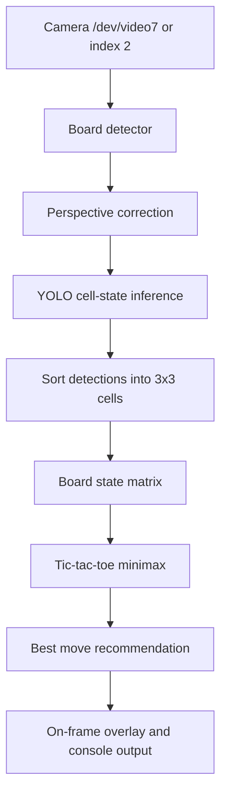

# STM32MP257 Tic-Tac-Toe Vision Architecture Research

## What the shipped ST package already gives us

The local `source-files/` tree is not just a pile of demos. It already contains the exact runtime shapes needed for this project: camera bring-up scripts, an appsink-based inference loop, wrappers around the ST AI runtime, and separate examples for ONNX Runtime and TFLite delegate execution.

### Camera and GStreamer path

- [source-files/demo/application/camera/bin/launch_camera_control_mp25.sh](../source-files/demo/application/camera/bin/launch_camera_control_mp25.sh#L123) builds the camera source string and switches between `libcamerasrc` and `v4l2src`.
- [source-files/demo/application/camera/bin/launch_camera_preview_mp25.sh](../source-files/demo/application/camera/bin/launch_camera_preview_mp25.sh#L21) turns that source string into a Wayland preview graph.
- [source-files/x-linux-ai/resources/setup_camera.sh](../source-files/x-linux-ai/resources/setup_camera.sh#L1) handles board and USB camera discovery, V4L2 setup, and the fallback device selection logic.
- [source-files/x-linux-ai/resources/check_camera_preview.sh](../source-files/x-linux-ai/resources/check_camera_preview.sh#L1) is the quick camera presence check that the demos use before launching.

### ST AI runtime and model loading

- [source-files/x-linux-ai/object-detection/stai_mpu_object_detection.py](../source-files/x-linux-ai/object-detection/stai_mpu_object_detection.py#L1) shows the general object-detection app structure: camera pipeline, appsink callback, inference, and UI refresh.
- [source-files/x-linux-ai/object-detection/ssd_mobilenet_pp.py](../source-files/x-linux-ai/object-detection/ssd_mobilenet_pp.py#L1) is the reusable model wrapper that creates `stai_mpu_network`, loads labels, and decodes detections.
- [source-files/x-linux-ai/image-classification/mobilenet_pp.py](../source-files/x-linux-ai/image-classification/mobilenet_pp.py#L1) is the smallest example of the same inference wrapper pattern.
- [source-files/x-linux-ai/people-tracking-heatmap/stai_mpu_people_tracking_heatmap.py](../source-files/x-linux-ai/people-tracking-heatmap/stai_mpu_people_tracking_heatmap.py#L1) is the most useful YOLO-based template because it already combines GStreamer, appsink inference, tracking, and on-frame annotation.
- [source-files/x-linux-ai/people-tracking-heatmap/yolov8_pp_annotator.py](../source-files/x-linux-ai/people-tracking-heatmap/yolov8_pp_annotator.py#L1) contains the YOLO post-processing and annotation helpers used by that demo.

### ONNX, TFLite, and runtime examples

- [source-files/bin/ort-vsinpu-ep-example/ort-vsinpu-ep-example.py](../source-files/bin/ort-vsinpu-ep-example/ort-vsinpu-ep-example.py#L1) shows the ONNX Runtime path with `VSINPUExecutionProvider`.
- [source-files/bin/tflite-vx-delegate-example/tflite-vx-delegate-example.py](../source-files/bin/tflite-vx-delegate-example/tflite-vx-delegate-example.py#L1) shows the TFLite runtime path with the VX delegate.
- [source-files/x-linux-ai/resources/config_board_npu.sh](../source-files/x-linux-ai/resources/config_board_npu.sh#L1) shows how the shipped package chooses model formats on MP25 boards, including `.nb`, `.tflite`, and `.onnx` branches.

### Launcher and deployment flow

- [source-files/demo/demo_launcher.py](../source-files/demo/demo_launcher.py#L361) loads board-specific YAML files, scans application tiles, and dispatches scripts or Python modules.
- [source-files/demo/gtk-application/206-stai-mpu-object-detection-py-ovx-mp2.yaml](../source-files/demo/gtk-application/206-stai-mpu-object-detection-py-ovx-mp2.yaml#L1) shows how a shipped demo is registered in the launcher.
- [source-files/demo/gtk-application/700-stai-mpu-people-tracking-py-ovx.yaml](../source-files/demo/gtk-application/700-stai-mpu-people-tracking-py-ovx.yaml#L1) shows the YOLO-based people tracking entrypoint.
- [source-files/x-linux-ai/people-tracking-heatmap/launch_python_people_tracking_heatmap.sh](../source-files/x-linux-ai/people-tracking-heatmap/launch_python_people_tracking_heatmap.sh#L1) is the cleanest direct launcher for a YOLO-style model on MP25.

## What the local training data says

The training data is not generic object detection. The labels describe board cells as `empty`, `red_ball`, and `yellow_ball`, which means the model is predicting the state of each cell rather than free-floating pieces.

- [data.yaml](../data.yaml#L1) defines the three classes used by the model.
- [dataset/labels/03aeb25d-ball_20260529_141441_016279.txt](../dataset/labels/03aeb25d-ball_20260529_141441_016279.txt#L1) shows the YOLO format used in the dataset.

That matters. It makes the board extraction problem a geometry and assignment problem, not a piece-finding problem.

## Recommended architecture

### Option A: Pure YOLO

Run YOLO on the camera frame, sort detections by location, and map them directly to the 3x3 grid.

Pros:

- Lowest implementation effort.
- Lowest moving parts on the board.
- Works well if the board is always centered and the camera never moves much.

Cons:

- Perspective changes can shift detections across cell boundaries.
- Small camera motion can cause row and column jitter.
- The model has to absorb all geometric variation on its own.

### Option B: OpenCV + YOLO

Detect the board, rectify the image, split into 9 cells, then run YOLO on the normalized board.

Pros:

- Most robust against board movement and camera angle changes.
- Keeps the model focused on cell state instead of raw geometry.
- Fits the data you already trained, because the labels are cell-state boxes.
- Easier to stabilize over time with a small history window.

Cons:

- One more classical CV step to maintain.
- Board detection must be tuned for the board outline and lighting.

### Option C: OpenCV only

Detect the board and classify each cell with color rules only.

Pros:

- No neural model needed at inference time.

Cons:

- Too brittle under lighting changes, shadows, glare, and color drift.
- Red and yellow pieces are easy to confuse in real rooms.
- Hard to keep stable when the board or camera moves.

### Choice

Option B is the right default for this project.

The reason is simple: the board is structured, the classes are tiny, and the camera is not guaranteed to stay still. OpenCV handles the geometry. YOLO handles the cell-state classification. Minimax handles the move decision. Each layer does one job.

## Runtime flow



## Reusable ST code

The following patterns are worth reusing directly in the new pipeline:

- `libcamerasrc` + `appsink` split pipelines from [stai_mpu_object_detection.py](../source-files/x-linux-ai/object-detection/stai_mpu_object_detection.py#L1).
- The `stai_mpu_network` wrapper shape from [ssd_mobilenet_pp.py](../source-files/x-linux-ai/object-detection/ssd_mobilenet_pp.py#L1) and [mobilenet_pp.py](../source-files/x-linux-ai/image-classification/mobilenet_pp.py#L1).
- The YOLO annotation flow from [stai_mpu_people_tracking_heatmap.py](../source-files/x-linux-ai/people-tracking-heatmap/stai_mpu_people_tracking_heatmap.py#L1) and [yolov8_pp_annotator.py](../source-files/x-linux-ai/people-tracking-heatmap/yolov8_pp_annotator.py#L1).
- The board-side launcher model in [demo_launcher.py](../source-files/demo/demo_launcher.py#L361), which is useful if the final app gets packaged into the ST tile system later.

## Deployment path

The local code should follow this path for development and validation:

```text
best.pt
  -> ONNX
  -> TFLite
  -> ST board validation or packaging
```

The ST package already exposes the two runtime examples that validate the exported formats on MP257-class hardware:

- [ort-vsinpu-ep-example.py](../source-files/bin/ort-vsinpu-ep-example/ort-vsinpu-ep-example.py#L1)
- [tflite-vx-delegate-example.py](../source-files/bin/tflite-vx-delegate-example/tflite-vx-delegate-example.py#L1)

If you later want the fastest MP257-specific path, the shipped `config_board_npu.sh` shows that `.nb` is the native NPU-targeted format in the X-LINUX-AI stack.

## Algorithm summary

1. Detect the outer board quad.
2. Warp the board into a square canonical frame.
3. Run YOLO on the warped board.
4. Assign each detection to the nearest of the 9 cell centers.
5. Build a 3x3 matrix with `E`, `R`, and `Y`.
6. Run minimax to get the best response.
7. Draw the board and the recommended move back onto the live image.

## Future improvements

- Add a more explicit board corner detector that uses grid lines when the outer contour is weak.
- Add temporal vote smoothing for the AI move as well as the board state.
- Add an offline evaluation script that replays validation images and records board-level accuracy.
- Add a board-state lockout rule so the AI only reacts when the board stays stable for a few frames.
