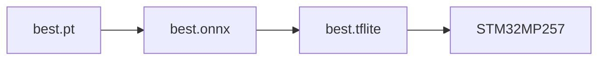

# STM32MP257 Deployment Guide

## Flow



## Step 1. Export ONNX

```bash
python src/stm32/export_to_onnx.py \
    --weights runs/detect/train/weights/best.pt \
    --output build/best.onnx
```

## Step 2. Export TFLite

```bash
python src/stm32/export_to_tflite.py \
    --source build/best.onnx \
    --output build/best.tflite
```

If you want to skip the ONNX intermediate for a local smoke test, the same converter also accepts a `.pt` source file.

## Step 3. Run the live app on Windows

```bash
python main.py \
    --camera 2 \
    --weights runs/detect/train/weights/best.pt
```

## Step 4. Run the live app on STM32MP257

```bash
python main.py \
    --camera /dev/video7 \
    --weights build/best.onnx
```

If the board only exposes a USB camera through the auto-detection path, this also works:

```bash
python main.py \
    --camera auto \
    --weights build/best.tflite
```

## Step 5. Validate on the ST runtime examples

The shipped ST package already has examples that match the runtime families used by MP257:

```bash
python3 /usr/local/x-linux-ai/bin/ort-vsinpu-ep-example/ort-vsinpu-ep-example.py build/best.onnx
python3 /usr/local/x-linux-ai/bin/tflite-vx-delegate-example/tflite-vx-delegate-example.py build/best.tflite
```

Those examples are useful when you want to validate the exported artifact directly against the board runtime without the rest of the application.

## Board-side notes

The shipped X-LINUX-AI package uses `libcamerasrc`, `appsink`, and a launcher script pattern that keeps the preview path separate from the inference path. The relevant examples are in `source-files/x-linux-ai/people-tracking-heatmap/` and `source-files/x-linux-ai/object-detection/`.

For the fastest MP25 deployment path, the ST package still prefers `.nb` after ST Edge AI packaging. That is why the exported ONNX and TFLite artifacts are treated as the handoff format, not the final end state.

## Practical command sequence

```bash
# 1. Export the model
python src/stm32/export_to_onnx.py --weights runs/detect/train/weights/best.pt --output build/best.onnx
python src/stm32/export_to_tflite.py --source build/best.onnx --output build/best.tflite

# 2. Run the local app
python main.py --camera 2 --weights runs/detect/train/weights/best.pt

# 3. Validate on the board
python3 /usr/local/x-linux-ai/bin/ort-vsinpu-ep-example/ort-vsinpu-ep-example.py build/best.onnx
python3 /usr/local/x-linux-ai/bin/tflite-vx-delegate-example/tflite-vx-delegate-example.py build/best.tflite
```
